# 📚 Book Rental System

A modern **Library Management System** built using the latest stack: **Laravel 12**, **Vue.js 3**, **TypeScript**, **Tailwind CSS**, and **Inertia.js**.

The system is designed as an internal tool for small-scale library usage, where authenticated users can manage authors, books, and track the loan status of each book. The application uses a Single Page Application (SPA) approach for a fast and responsive user experience.

The project uses **MySQL/MariaDB** as the relational database, and leverages **Redis** for session/cache management in containerized environments with **Docker**. Testing is handled via **PHPUnit**, and static analysis is enforced with tools like **Larastan** and **PHP CS Fixer**.

This project includes automated PHPUnit tests to ensure code quality and reliability.

---

## 🚀 About the Project

This project represents a streamlined **book rental system** tailored for limited internal usage (e.g. school, company, or local library). It allows a predefined group of users (seeded via database) to log in, view and manage authors and books, and track which books are currently rented or available.

## 📥 Install Project

To get started, follow these steps:

**1. Create the environment file:**
   - Run this command to clone the project:
     - `git clone https://github.com/Developer-Samuel/BookRental.git`

**2. Open the project directory:**
   - Change into the project folder:
     - `cd BookRental`
   - Or open the `BookRental` folder in your code editor/IDE.

## 🧰 Environment Setup

### 🐳 For Docker Development/Production

**1. (Optional) Clean up any running containers:**
  - `docker compose down -v --remove-orphans`

**2. Build and start Docker containers for setup:**
  - `docker compose --profile setup up --build`

**3. Run Docker containers normally:**
  - To run in the foreground (ideal for production testing or backend debugging):
    - `docker compose up`
  - To run in the background (recommended for production):
    - `docker compose up -d`

**4. Running Docker containers for development (frontend with Vite):**
  - To start services under the `dev` profile, run:
    - `docker compose --profile dev up`
  - You can add `-d` if you want to run detached:
    - `docker compose --profile dev up -d`

#### ⚠️ Troubleshooting permissions or log file issues

If you encounter permission problems or cannot find Laravel logs, execute the following commands **inside** the running app container:
  - `docker exec -it book_rental_app bash`
  - `ls -l /var/www/storage/logs/`
  - `cat /var/www/storage/logs/laravel.log`
  - `chmod -R 775 /var/www/storage`
  - `chown -R www-data:www-data /var/www/storage /var/www/bootstrap/cache`
  - `exit`

### 🖥️ Local Development (XAMPP/YAMPP etc.)

**1. Create the environment file:**
   #### Choose the appropriate `.env` file based on your environment setup. 
   - Duplicate `env.example.local` and rename the copy to `.env` for production.
   - Duplicate `env.example.local.dev` and rename the copy to `.env` for development.

**2. Install dependencies:**
   - Run the following commands in your terminal:
     - `composer update`
     - `php artisan key:generate`
     - `npm install`

**3. Set up the database:**
   - Run migrations and seed the database with initial data by executing:
     - `php artisan migrate --seed`
       
**4. Run the project:**
   - Start the Laravel server by running:
     - `php artisan serve`
   - Start the development server for Vue.js and TypeScript by running:
     - `npm run dev`

**5. The project is now ready to use.**

##### 🧪 Optional Development Tools

**6. Run tests (optional)**
   - To run the Laravel test suite, use:
     - `php artisan test`

**7. Run Larastan (optional)**
   - To perform static analysis using Larastan, run:
     - `composer analyse`

**8. Run PHP Fixer (optional)**
   - To automatically fix PHP coding style issues, run:
     - `composer fix`

## ✅ Features

### 🔐 Secure Login
-  **Authentication** is restricted to pre-created users (seeded via DB).
-  **No public registration** - access is intended for authorized personnel only.
-  **Brute-force protection** - Login attempts are limited to 5 per minute per session, ensuring security without affecting other users on the same network.

### 📚 Authors & Books CRUD
- Full **Create / Read / Update / Delete** operations for:
  - **Authors**
  - **Books**, each linked to an `author_id`.
- All books have a **loan status** tracked via a boolean field **is_borrowed** (0 = available, 1 = borrowed), indicating whether the book is currently rented..

### 🧾 Book Rental Tracking
- Staff members can update book status manually to reflect real-world rentals.
- Simple, clear interface for checking which books are rented and which are available.

## ⚙️ Implementation Details
- Countries import and update is implemented as a scheduled Laravel command that fetches data from an external API and updates the database.
- Database migrations use Laravel macros and custom schema builders to ensure reusable and clean code.
- Caching leverages Laravel cache with expiration policies tuned for performance.

## 🧱 Technology Stack

| Layer          | Tech Stack                      |
| -------------- | ------------------------------- |
| Backend        | PHP 8.2 - 8.3, Laravel 12      |
| Frontend       | Vue.js 3 + TypeScript           |
| Styling        | Tailwind CSS                    |
| SPA Routing    | Inertia.js                      |
| Database       | MySQL / MariaDB                 |
| Infrastructure | Docker, Redis                   |
| Testing        | PHPUnit                         |
| Tools          | Larastan, PHP CS Fixer          |

## 🗂️ Project Structure

### App Directory
- `app/Console` - CLI commands and scheduled tasks
- `app/Constants` - Constant values
- `app/Contracts`- Interfaces defining contracts for services and repositories
- `app/Core` - Base classes, abstractions, helpers, and traits used across the app
- `app/Enums` - Enumeration classes representing fixed sets of values
- `app/Http/Controllers` - Controllers handling HTTP requests and responses
- `app/Http/Middleware` - Middleware to filter and process HTTP requests
- `app/Http/Requests` - Form request validation logic
- `app/Http/Responders` - Response formatting
- `app/Models` - Eloquent models representing database entities
- `app/Providers` - Service providers to bootstrap application services
- `app/Repositories` - Data access layers abstracting database operations
- `app/Rules` - Custom validation rules
- `app/Seeders` - Classes to seed initial or test data into the database
- `app/Services` - Business logic and reusable service classes
- `app/Trackers` - Classes related to tracking user actions or events
- `app/Views` - Classes preparing data and props for frontend views (Inertia.js)

### Database Directory
- `database/factories` - Factories to create model instances for testing or seeding
- `database/macros` - Custom macros extending query builder or collections
- `database/migrations` - Migration scripts to create or modify database tables
- `database/schemas` - Database schema definitions or blueprints
- `database/seeders` - Seeder classes to populate the database with initial data
- `database/validators` - Database-level validation rules

### Tests Directory
- `tests/Feature`  

  High-level tests simulating real-world user interactions and full request flows.  
  This suite covers critical application workflows and ensures the system behaves correctly from end to end.  

  **Key areas tested here include:**
  - **Commands**: Tests for custom Artisan commands verifying their execution and side effects.  
  - **Core**: Tests for foundational reusable functions and utilities that underpin various features, ensuring consistent behavior.  
  - **Http\Controllers**: Tests focused on controller logic, validating request handling, response status codes, authorization, and input validation.

- `tests/Unit`  

  Fine-grained, low-level tests aimed at individual classes, methods, and business logic units.  
  This layer guarantees that core components behave predictably in isolation.  

  **Principal components covered:**
  - **Core\Controllers** and **Core\Traits**: Testing reusable traits and base controller logic to ensure DRY principles and robust abstractions.  
  - **Repositories**: Validating data access layers, query logic, and correct interaction with the persistence layer.  
  - **Services**: Ensuring business logic services function correctly, handle edge cases, and enforce domain rules reliably.

This dual-level testing strategy balances integration-style feature tests with rigorous unit tests to achieve maximum coverage, maintainability, and confidence in the system's correctness, following best practices and industry standards.

## ⚙️ Requirements

- PHP >= 8.2 (recommended up to 8.3)
- Composer  
- Node.js & npm  
- MySQL (or MariaDB)  
- Laravel CLI  
- Git  

## ☁️ Optional / Recommended Tools

The following tools are optional but recommended for better development and performance:

- **Docker** (for containerized development and deployment) 
- **Redis** (used for caching and queues to improve performance)

## 🛠️ Development Tools

This project uses several tools to maintain code quality, improve development workflow, and ensure consistent coding standards:

- **PHPUnit**  
  Automated testing framework for PHP to run unit and feature tests.  
  Run tests with:  
  - `php artisan test`

- **Larastan (PHPStan for Laravel)**  
  Static analysis tool to detect bugs and improve code quality.  
  Run analysis with:  
  - `composer analyse`

- **PHP CS Fixer**  
  Automatically fixes PHP coding style issues to follow PSR standards.  
  Run fixer with:  
  - `composer fix`

## 📊 Database Schema

Technical structure of the database with all entities and their relationships.

```mermaid
erDiagram
    users {
        int id "Primary Key"
        string username "Unique"
        string email "Unique"
        timestamp email_verified_at
        string password
        timestamp created_at
        timestamp updated_at
    }

    countries {
        int id "Primary Key"
        string name "Unique"
        string code "Unique"
        string nationality
        timestamp created_at
        timestamp updated_at
    }

    authors {
        int id "Primary Key"
        int country_id "Foreign Key → countries.id"
        string name
        string surname
        enum gender "male, female"
        date birth_date
        timestamp created_at
        timestamp updated_at
    }

    books {
        int id "Primary Key"
        int author_id "Foreign Key → countries.id"
        string title
        enum type "art, fantasy..."
        boolean is_borrowed
        timestamp created_at
        timestamp updated_at
    }

    countries ||--o{ authors : "located in"
    authors ||--o{ books : "writes"
```

## 📊 Visual Schema Overview

Graphical representation of tables and their relationships for easier understanding.

## 📦 Models Overview

## 📸 Screenshots

### Authors table

### Books table

## 📝 License

This project is licensed under the **Samuel Šteiner License**.

### Permissions: ###
- **✅ Free for personal, non-commercial, and educational use.**
- **✅ Code may be studied, modified, and used locally for learning purposes.**

### Restrictions: ###
- **❌ Commercial use is prohibited** without explicit written permission from the author.
- **❌ Redistribution** of the project or any part of it as part of a paid or proprietary product is not allowed.
- **❌ Use in closed-source or proprietary systems is not permitted.**

### Commercial Use ###
If you wish to use this project for commercial purposes, or as the base for another product, you must contact the author to obtain a separate license or written permission.

### Attribution ###
Please retain this license notice in any permitted redistribution, including forks and educational modifications.

---

The Laravel framework is open-sourced software licensed under the [MIT license](https://opensource.org/licenses/MIT).
